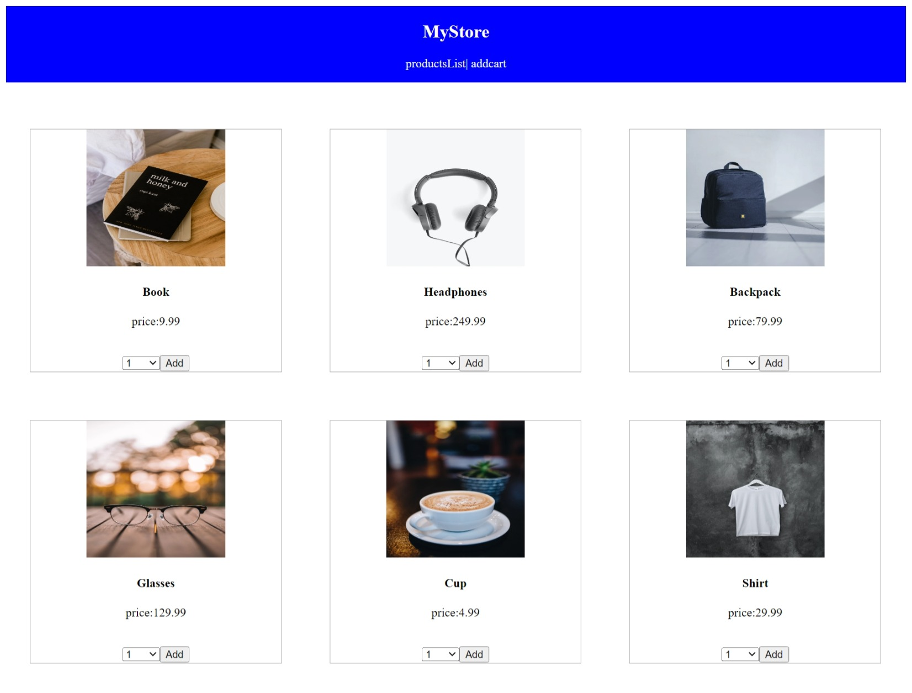

# MyStore :smile:

This project is single application by Angular
This project was generated with [Angular CLI](https://github.com/angular/angular-cli) version 14.2.8.
It shows idea shopping online,it shows products then the User add who he want it to the cart


## Development server

Run `ng serve` for a dev server. Navigate to `http://localhost:4200/`. The application will automatically reload if you change any of the source files.

## Code scaffolding

Run `ng generate component component-name` to generate a new component. You can also use `ng generate directive|pipe|service|class|guard|interface|enum|module`. or by shorted `ng g c|s|m`


## Primary Features :flushed:
 #### Components
   - Product-list : shows the all products
   - Product : defines the product's features
   - Product-details: show description and details of product
   - AddCart : shows what user add to the cart
   - Form-validation : form where user able to input his info.
    - Success : End of journey for shopping  for user
 #### Services

- AddService : 
a service to add user product to the own cart 
it shows products will buy it and the total price
- HttpService:
a service special to adding Behavior Subject
it adding the url  and getting the products 
 <http://localhost:4200/assets/data.json> 


## App.Module.ts
 *import part is important for running the project*
 inside **@NgModule** in imports array
``` Typescript
imports: [
    BrowserModule,
    AppRoutingModule,
    FlexLayoutModule  ,
    HttpClientModule,
    FormsModule,
],
   ```
 ## AppRoutingModule
 the part specific the routes for the project
 ``` Typescript
const routes: Routes = [
  { path: '', component: ProductListComponent },
  { path: 'addcart', component:AddcartComponent},
  { path: 'product', component:ProductComponent},
  {
    path: 'details/:id',
    component: ProductDetailsComponent
  },
  {
    path:'success/:username/:total',
    component:SuccessComponent
  }
];
 ```


## Styling :dress:

we use CSS for styling pages


## Running unit tests

Run `ng test` to execute the unit tests via [Karma](https://karma-runner.github.io).

## Running end-to-end tests

Run `ng e2e` to execute the end-to-end tests via a platform of your choice. To use this command, you need to first add a package that implements end-to-end testing capabilities.


